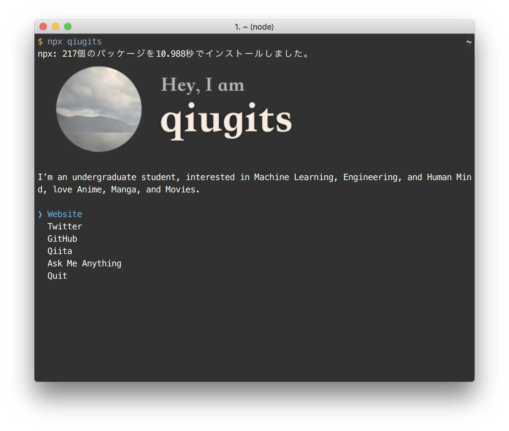

# qiugits [](https://travis-ci.org/qiugits/qiugits)

> The [QiuGits](https://gitshell.net) CLI

<!--

-->

## Usage

Install Node.js, then:

```
$ npx qiugits
```


## Built with

- [ink](https://github.com/vadimdemedes/ink) - React for interactive command-line apps
- [terminal-image](https://github.com/sindresorhus/terminal-image) - Display images in the terminal


## License

MIT © [QiuGits](https://gitshell.net)
